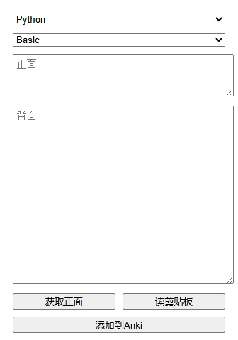
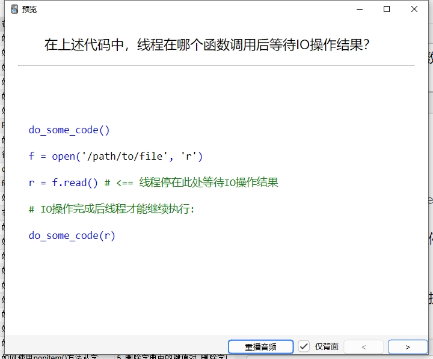

# AI 问答卡片生成器

## 项目简介
这是一个 Chrome 浏览器扩展，可以快速将网页中选中的内容添加到 Anki 中，并使用 AI 自动生成对应的问题。该工具特别适合：
- 学习者快速制作复习卡片
- 教育工作者批量创建教学卡片
- 知识管理爱好者收集和整理信息

## 功能特点
- 自动根据答案内容生成相关问题
- 支持快捷键（Alt+Q）快速打开
- 记住上次选择的牌组
- 支持 Python 代码格式化(实现高亮还需配置js和CSS文件)
- 简洁的用户界面
- 实时错误提示
- 支持自定义 API 配置

## 技术栈
- JavaScript
- HTML/CSS
- Chrome Extension API
- AnkiConnect API
- MiniMax AI API (abab6.5s-chat 模型)

## 安装说明
1. 克隆项目到本地,到浏览器插件管理中加载

2. 配置 API：
   - 复制 `config.template.js` 为 `config.js`
   - 在 `config.js` 中填入你的 API 配置信息

3. 安装扩展：
   - 打开 Chrome 浏览器
   - 访问 `chrome://extensions/`
   - 开启"开发者模式"
   - 点击"加载已解压的扩展程序"
   - 选择项目目录

4. 安装 AnkiConnect：
   - 打开 Anki
   - 工具 -> 附加组件
   - 获取插件 -> 输入代码：2055492159
   - 重启 Anki

## 使用说明
1. 在网页中选中要添加到 Anki 的文本
2. 按 Alt+Q 或点击扩展图标打开工具
3. 选择目标牌组
4. 如果需要，可以编辑自动生成的问题
5. 点击"添加到Anki"按钮保存卡片

## 特殊功能
- Python 代码格式化：当选择的牌组名称包含"python"时，会自动添加代码格式化标签
- 记忆功能：会记住上次选择的牌组
- 快捷键支持：Alt+Q 快速打开扩展

## 注意事项
1. 使用前确保 Anki 已启动
2. 确保 AnkiConnect 插件已正确安装
3. 需要配置有效的 MiniMax API 密钥
4. 确保浏览器有访问 `localhost:8765` 的权限

## 常见问题
1. 如果无法连接到 Anki：
   - 检查 Anki 是否运行
   - 确认 AnkiConnect 插件是否正确安装
   - 重启 Anki 和浏览器

2. 如果 AI 生成失败：
   - 检查 `config.js` 配置是否正确
   - 确认 API 密钥是否有效
   - 查看浏览器控制台是否有错误信息

## 贡献指南
欢迎提交 Issue 和 Pull Request 来改进项目。在提交代码前，请确保：
1. 代码风格保持一致
2. 添加必要的注释
3. 更新相关文档
4. 测试功能正常

## 许可证
[添加许可证信息]